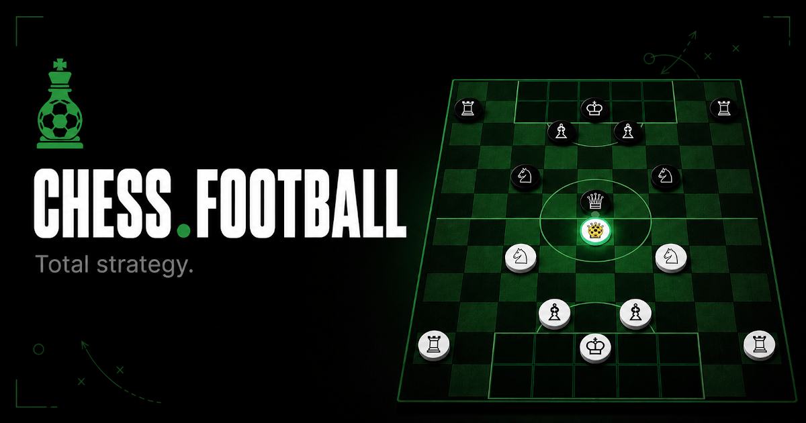

<p align="center">
  
</p>

# @scriptonita/chess-football-ui

Shared, framework-agnostic React UI for **Chess.Football**: board, pieces, scoreboard,
controls, the zustand game store and a small set of UI primitives. Consumed by both the
Next.js app (`futbolajedrez`) and the CrazyGames Vite SPA (`chess-football-crazygames`).

It builds on top of [`@scriptonita/chess-football-engine`](https://www.npmjs.com/package/@scriptonita/chess-football-engine)
(the pure rules engine) and adds the **presentation layer** that was previously duplicated
across both games.

> **Rules source of truth:** the human-readable spec lives at
> [github.com/Scriptonita/chess.football](https://github.com/Scriptonita/chess.football),
> implemented in code by [`@scriptonita/chess-football-engine`](https://www.npmjs.com/package/@scriptonita/chess-football-engine).
> This package is the shared presentation layer on top of it.

## Install

```bash
npm install @scriptonita/chess-football-ui
```

## Design notes

- **Framework-agnostic.** No `next-intl`, no `next/*`, no `"use client"`. Translations are
  injected through `GameI18nProvider` (a `t: (key: string) => string` scoped to the `game`
  namespace), so each app wires its own i18n (`next-intl` or `react-i18next`).
- **Store included.** Unlike the engine (pure), this package owns the zustand game store
  (`useGameStore`, `getInitialBoardState`) so the components are self-contained and the store
  is no longer duplicated per app.
- **Tokens stay per app.** Components use Tailwind utility classes bound to design tokens
  (`bg-bg-surface`, `text-accent-green`, …). Each app must define those tokens and include this
  package's files in its Tailwind `content`/`@source` scan so the classes are generated.

## Host app contract

Two things the package cannot enforce at build time and every consumer must check:

**1. Translation coverage.** `GAME_I18N_KEYS` is the manifest of every `game`-namespace key
the components read. Assert it in each app's test suite — without this, a key added here
surfaces as raw text on the pitch (`⚠ game.offsideWarning`) instead of failing CI:

```ts
import { GAME_I18N_KEYS } from '@scriptonita/chess-football-ui'
import es from './messages/es.json'

const missing = GAME_I18N_KEYS.filter(k => !k.split('.').reduce<any>((o, p) => o?.[p], es.game))
expect(missing).toEqual([])
```

**2. Design tokens.** Components emit Tailwind classes bound to tokens the app defines. A
token that is missing fails silently — the rule simply does not apply. The board's
`--last-move-highlight`, `--move-highlight`, `--pass-highlight`, `--accent-green`,
`--accent-green-light` and `--accent-green-dark` are all required.

## Peer dependencies

`react`, `react-dom`, `framer-motion`, `lucide-react`.

## Scripts

- `npm run build` — bundle ESM + CJS + `.d.ts` with tsup.
- `npm run typecheck` — `tsc --noEmit`.
